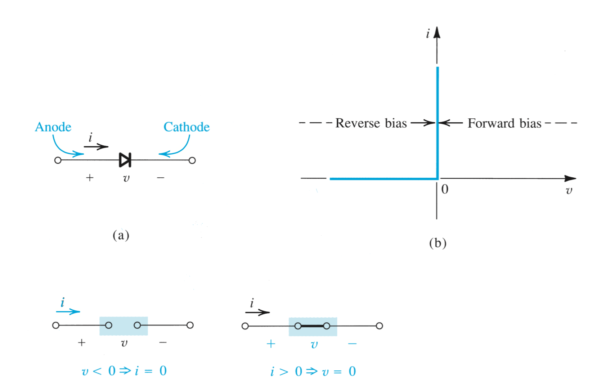
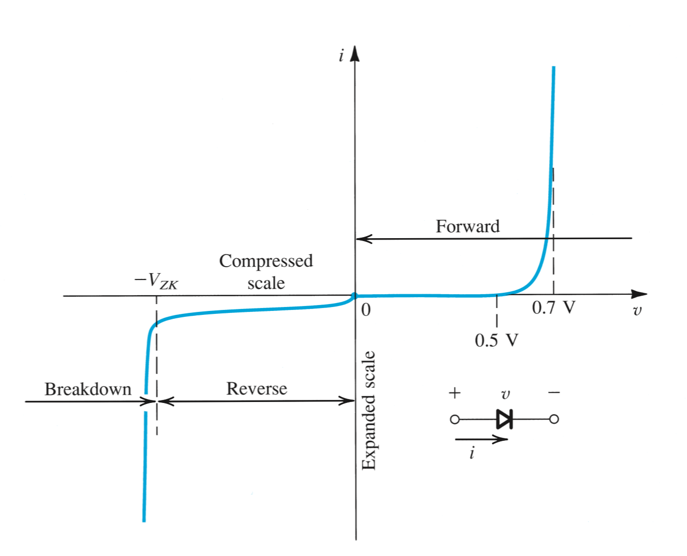

# Para control 2

## Diodos

## Diodo ideal

### Característica corriente-voltaje

Cuando los diodos operan en modo _reverse biased_, tenemos que el diodo se comporta como un circuito abierto. Cuando pasa esto se dice que el diodo está apagado. Por otro lado, si la corriente es positiva, el diodo se comporta como un cortocircuito.

Notar que al momento de usar un diodo, hay que implementarlo teniendo en cuenta algún mecanismo para limitar la corriente que pasa por el diodo.

El terminal positivo del diodo se llama ánodo y el negativo cátodo.

### Características de los terminales de los Diodos

La implementación más común de los diodos usa una juntura _pn_.

Tenemos distintas regiones:

  + Foward bias cuando $v>0$
  + reverse bias con $v<0$
  + breakdown region $v<-V_{ZK}$

#### Forward-bias region

Es la región en la que se opera cuando el voltaje $v$ es positivo. En esta región, la curva $v-i$ se acerca mucho a:

$$
i=I_S(e^{v/V_T}-1)
$$

En esta ecuación $I_S$ es una cte para un determinado diodo a una determinada temperatura. La corriente $I_S$ se suele llamar __corriente de saturación__ o __corriente de escala__. Este segundo nombre se lo debe a que es directamente proporcional al área transversal del diodo. Aunque depende mucho de la temperatura, más o menos $I_S$ duplica su valor cada 5ºC aprox.

El voltaje $V_T$ es una cte que se llama el __voltaje térmico__ y está dado por:

$$
V_T=\frac{k_BT}{q}
$$

donde:

  + $k_B$ es la cte de Boltzmann
  + $T$ es la temperatira en Kelvin
  + $q$ es la magnitud de la carga del electron

Para análisis vamos a usar $V_T\approx 25 mV$ a temperatura ambiente (20ºC)

Si tenemos que la corriente que pasa por el diodo es muy mayor a $I_S$, tenemos que podemos aproximar la curva de la siguiente manera:
$$
i\approx I_Se^{v/V_T}
$$

Esta relación se puede expresar con la función inversa de manera logarítmica:

$$
v=V_T\ln\left(\frac{i}{I_S}\right)
$$

Para un voltage $V_1$ y otro $V_2$ Tenemos

$$
I_1=I_Se^{V_1/V_T} ;\qquad I_2=I_Se^{V_2/V_T}
$$

juntando estas ecuaciones tenemos:

$$
\frac{I_2}{I_1}=e^{(V_2-V_1)/V_T}
$$

Que puede ser reescrita de la siguiente manera:

$$
V_2-V_1=V_T\ln\frac{I_2}{I_1}=2.3V_T\log\frac{I_2}{I_1}
$$

esto nos dice que por cada década de cambio en corriente, el voltaje del diodo cae en $2.3V_T$ que es $\approx 60mV$

#### Región reverse bias

A esta región se entra cuando el voltaje presente entre los terminales del diodo es negativo. En la ecuación de la curva $i-v$ tenemos que si $v$ es negativo t además tiene mayor magnitud que $V_T$, tenemos:

$$
i\approx -I_S
$$

Por eso se le llama la corriente de saturación. En la vida real los diodos presentan corrientes de saturación con una magnitud mucho mayor a $I_S$, aunque siguen siendo muy pequeñas
